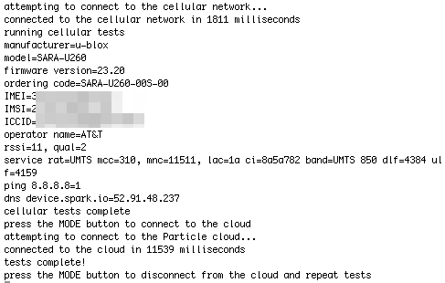

# Electron Cellular Example

*Example code for using the Particle Electron to directly access the u-blox cellular modem*

**There is a new version of this code available here:**

[https://github.com/rickkas7/CellularHelper](https://github.com/rickkas7/CellularHelper)

The newer version includes a rewritten parser code internally, some cleaned up APIs. It also includes a new sample program that can scan for all carriers even when your SIM can't connect to the tower. 

The new version is also in the community libraries as CellularHelper so you don't need to copy and paste the code to use it now.

I recommend using that version.

---

Here's some sample code you can use to get information about your cellular connection. It can retrieve:

- Model information
- ICCID, IMEI, IMSI numbers
- Cellular operator ("AT&T" for example)
- Signal strength (RSSI) and quality
- Cellular band ("UMTS 850" for example)

It also can test ping and DNS using the functions in the cellular modem. And it can test connecting to the Particle cloud.



It can sometimes also get information about neighboring cell sites. That works for me on 2G (G350) but not 3G (U260) but I'm not sure why. You might see something like this:

```
rssi=15, qual=99
service rat=GSM mcc=310, mnc=11094, lac=2 ci=a782 band=GSM 900 bsic=3b arfcn=237 rxlev=39
neighbor 0 rat=GSM mcc=310, mnc=11094, lac=8057b0f ci=a56f band=GSM 900 bsic=18 arfcn=235 rxlev=37
neighbor 1 rat=GSM mcc=310, mnc=11094, lac=100 ci=a5f2 band=GSM 900 bsic=25 arfcn=180 rxlev=21
```

You will likely need to official manual in order to make sense of these parameters, and even then it may not help!

[https://www.u-blox.com/sites/default/files/u-blox-ATCommands_Manual_(UBX-13002752).pdf] (https://www.u-blox.com/sites/default/files/u-blox-ATCommands_Manual_(UBX-13002752).pdf)

Updates to the code are here:

[https://github.com/rickkas7/electron_cellular] (https://github.com/rickkas7/electron_cellular)


